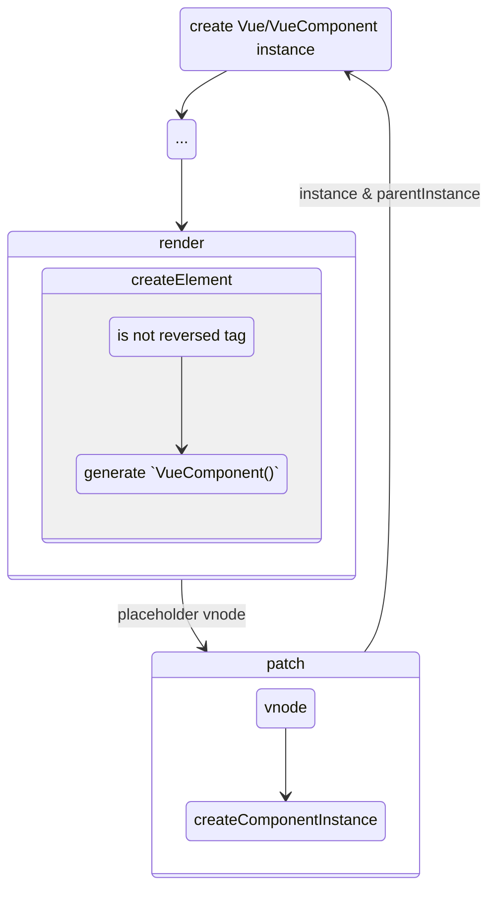

# 组件的挂载、更新与销毁

这篇文章分析 `Vue` 的组件挂载，会从 `createElement()` 函数开始讲起，这个函数的作用是创建 `VNode` 节点。

对于组件的挂载，会经历如下过程：



- 判断是否是组件
  - 判断是否注册了该组件
- 创建组件
  - 创建组件的构造函数
  - 设置 `props`
  - 返回组件的占位节点
- 挂载组件
  - 创建组件实例
  - 挂载 DOM 节点

## 判断是否是组件

在 `createElement()` 函数中，怎么才能知道一个标签表示的是组件呢？

很简单，根据这个标签是否是内置标签即可：

```js
function createElement(vm, tag, data, children) {
  let vnode
  let Ctor
  if (typeof tag === 'string') {
    if (config.isReversedTag(tag)) {
      // 是内置标签，如 div, p 等
      vnode = new VNode(tag, data, children)
    } else if (Ctor = vm.options.components[tag]) {
      // 注册了该组件
      vnode = createComponent(Ctor, data, children)
    }
  } else {
    // 标签不是 string 类型的话，就认为是组件
    vnode = createComponent(tag, data, children)
  }
}
```

## 组件节点

当我们声明一个 `Vue` 的组件时，是通过下面的方式声明的：
```js
const Comp = {
  name: 'Comp',
  data() {
    return {

    }
  },
  methods: {
    // ...
  }
}
```

而声明根组件实例时，是通过另一种方式：

```js
const root = new Vue({
  el: '#app',
  data() {
    return {

    }
  },
  methods: {
    // ...
  }
})
```

两种方式对比，很明显第二种方式更利于组件的复用：

- 第一种方式是对象风格的，这种风格可以理解为单例
- 第二种方式是类式风格的，每个实例之间是互不影响的

`Vue` 在内部就做了一层转换，将组件的声明对象转换为一个名为 `VueComponent` 的构造函数，而这个工作就由 `Vue.extend()` 完成。

### 组件的构造函数

`Vue.extend()` 其实很简单，简而言之就是：

- 把 `Vue` 上的属性和方法拿过来
- 把执行 `new Vue()` 的执行过程也拿过来

```js
Vue.extend = function(extendOptions) {
  const Super = Vue
  // 和 Vue 的函数声明一模一样
  const Sub = function VueComponent(options) {
    this._init(options)
  }

  // 复制原型方法
  Sub.prototype = Object.create(Super.prototype)
  Sub.prototype.constructor = Sub

  Sub.super = Super

  // 复制静态方法
  const { extend, mixin, use, components, directives, filters } = Super
  Sub.extend = extend
  Sub.mixin = mixin
  Sub.use = use
  Sub.components = components
  Sub.directives = directives
  Sub.directives = directives
  Sub.filters = filters

  Sub.options = extendOptions
  // 使得可以使用递归组件
  const name = extendOptions.name || Super.options.name
  if (name) {
    Sub.options.components[name] = Sub
  }

  return Sub
}
```

实际上 `Vue.extend()` 会对最终的结果缓存，因为对于一个组件的声明对象而言，每次的转换结果应该都是一样的：

```js
Vue.cid = 0
let cid = 1
Vue.extend = function(extendOptions) {
  const SuperId = Super.cid
  let cachedCtors
  if (!extendOptions._Ctor) {
    extendOptions._Ctor = {}
  }
  cachedCtors = extendOptions._Ctor

  if (cachedCtors[SuperId]) {
    return cachedCtors[SuperId]
  }

  // ... 保持不变
  Sub.cid = cid++
  cachedCtors[SuperId] = Sub
}
```

### 组件的占位节点

在完成上面的步骤后，会[设置 props](/data-and-props.html#设置-props)，并创建一个组件节点，该节点是用来占位的：

```js
const listeners = data.on
data.on = data.nativeOn

extractPropsFromVNodeData(data, Ctor)

const vnode = new VNode(
  `vue-component-${Ctor.cid}-${Ctor.options.name}`, data, children, /* componentOptions */ { Ctor, propsData, listeners, children }
)
```

## 挂载组件

在这一步之前，都是属于 `render()` 的部分，所以最终我们会得到一棵 `VNode` 树，而接下来就会通过 `patch()` 对节点进行挂载/更新。

### 组件节点的生命周期

- `init`
- `insert`
- `prepatch`
- `destroy`

在 `render()` 中创建组件的占位节点时，会给该对象上添加上面这几个方法，通过这些方法，对组件进行相应的操作。

### 创建组件实例 - `init`

创建组件实例很简单，和 `new Vue()` 差不多。

在上一个步骤中，我们已经创建了组件的占位节点，而该占位节点的 `componentOptions` 就保存着构造函数等信息：

```js
function init(vnode) {
  const child = vnode.componentInstance = new vnode.componentOptions.Ctor(options)

  child.$mount()
}
```

而这一步其实就是组件节点生命周期中的 init 的作用。

### 挂载

在创建后确实执行了 `mount()` 但是由于没有目标节点，所以并不会真正的挂载。

接下来会执行平台下的 `insert()` 方法（web 平台下是 `appendChild()` 或 `insertBefore()`）将组件的节点插入到父节点下。

```js
function createComponent(vnode, parentElm) {
  init(vnode)

  if (vnode.componentIntance) {
    platform.insert(parentElm, vnode.elm)
  }
}
```

### `mounted` 生命周期 - `insert`

你可能会觉得节点挂载后就应该马上触发组件实例的 `mounted` 生命周期，但事实上组件挂载后，不会立即触发 `mounted` 钩子。

因为上述的这个过程是深度遍历，所以同一路径上的组件，层级越深的组件反而越先挂载，根组件反而是最后挂载的。

而组件的生命周期是从根组件开始最先开始，依次触发的。`Vue` 会维护创建的组件实例，当根组件挂载后，依次触发 `mounted`。

```js
// 新增代码
const insertedVnodeQueue = []
function createComponent(vnode, parentElm) {
  init(vnode)

  if (vnode.componentIntance) {
    // 新增代码
    insertedVnodeQueue.push(vnode)
    platform.insert(parentElm, vnode.elm)
  }
}

// 新增代码
for (let i = 0; i < insertedVnodeQueue.length; i++) {
  callHook(insertedVnodeQueue[i].componentIntance, 'mounted')
}
```

而该函数就是组件节点的 `insert()` 钩子：

```js
const insertedVnodeQueue = []

function createComponent(vnode, parentElm) {
  init(vnode)

  if (vnode.componentIntance) {
    insertedVnodeQueue.push(vnode)
    platform.insert(parentElm, vnode.elm)
  }
}

// 新增代码
function insert(vnode) {
  callHook(vnode.componentIntance, 'mounted')
}

// 更新代码
for (let i = 0; i < insertedVnodeQueue.length; i++) {
  insert(insertedVnodeQueue[i])
}
```

## 更新组件 - `prepatch`

在[《虚拟 DOM》](/virtual-dom.html#patch)章节，介绍了组件的更新本质上是执行组件的 `render()` 函数从而生成新的 `VNode` 节点。但这只是视图的更新，实际上没这么简单，因为组件的状态、事件都需要更新，这是为了**子组件与父组件之间的状态同步**而做的更新。

所以在执行 `render()` 后，还需要进行以下操作：

- 更新 `props`
- 更新事件
- 触发 `updated` 生命周期

[更新 `props`](/data-and-props.html#设置-props)和[更新事件](/event.html#组件的事件)与初始化时的设置大致是类似的，而触发 update 生命周期会在异步更新队列中分析。

## 销毁组件 - `destroy`

组件的卸载是一个相对简单的过程（这里只涉及组件本身的卸载，不会设置其他，如指令的卸载等内容）：

- 从父组件的 `children` 列表中删除该组件实例
- 依赖监取消听器
- 清空事件

这些实际上就是 `Vue.prototype.$destroy()` 做的事：

```js
Vue.prototype.$destroy = function() {
  const vm = this

  callHook(vm, 'beforeDestroy')

  const parent = vm.$parent

  remove(parent.$children, vm)

  vm._watcher.teardown()

  callHook(vm, 'destroyed')

  vm.$off()
}
```

组件节点的生命周期和组件的生命周期是一个对应的关系：

```
insert    -   mounted
prepatch  -   beforeUpdate & updated
destroy   -   beforeDestroy & destroyed
```
