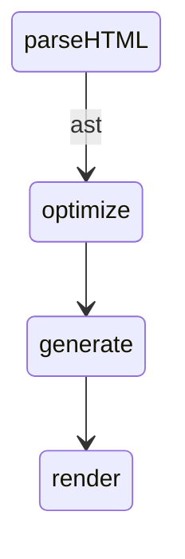
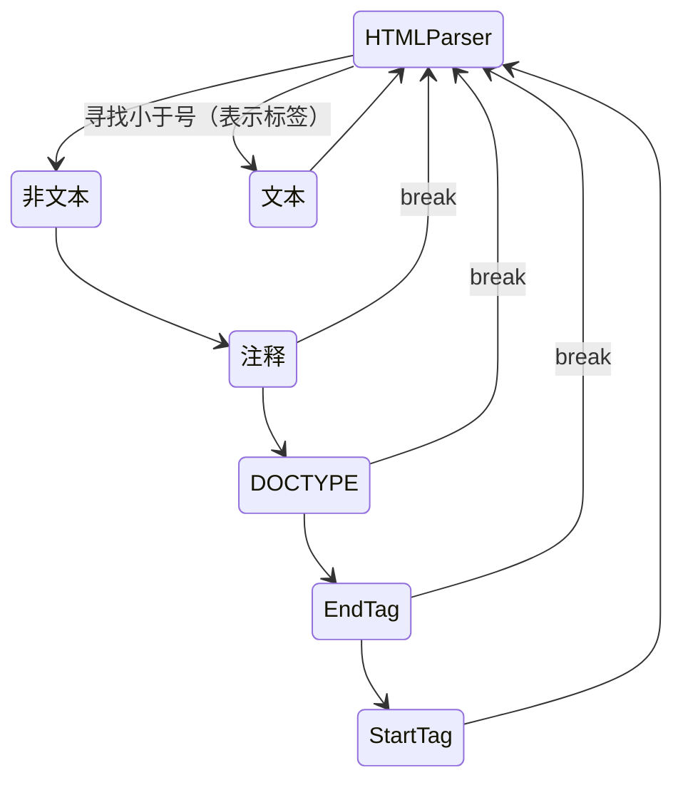

# 模板编译

模板编译分为三个步骤：

- 通过 HTMLParser 对 `template` 模板进行编译，最终得到 AST
- 遍历 AST 进行优化（optimize）
- 最终通过生成器生成 render 函数（generate）



该文章不会涉及 HTMLParser 的内容，感兴趣可以阅读[这篇文章](https://johnresig.com/blog/pure-javascript-html-parser/)。

## `HTMLParser` 生成 AST



### `start` 钩子

`start` 钩子会在标签及其属性解析完后触发，在这个钩子中主要完成了一下工作：
- 创建 AST 节点
- 对某些属性进行预处理（如 `input` 的 `v-model`）
- 标签进行记录，可以用于判断标签是否闭合（类似于括号配对）：

```js
const stack = []
let root
let currentParent
parseHTML({
  ...,
  start(tag, attrs, isUnary) {
    const element = createASTNode(tag, attrs, isUnary)
    if (!root) {
      root = element
    }
    if (!isUnary) {
      currentParent = element
      stack.push(element)
    } else {
      currentParent.children.push(element)
      element.parent = currentParent
    }
  }
})
```

### `end` 钩子

`end` 钩子在标签闭合时触发，在该钩子中完成如下工作：
- 维护父子节点关系
- 对属性进行处理

```js
const element = stack[stack.length - 1]
stack.length -= 1
currentParent = stack[stack.length - 1]

currentParent.children.push(element)
element.parent = currentParent
```

### `chars` 钩子

在 `chars` 钩子中，主要是含有标记的文本进行解析，然后添加到当前父节点中。

## `optimize` 优化器

先看一下什么是静态节点：简单来说就是渲染后，不会再发生变化的节点。那么它有什么好处呢？

- 不需要再为它创建新的子节点
- `patch` 阶段可以直接跳过

通过优化器找出静态（根）节点，并添加标记。

```js
function markStatic(node) {
  node.static = isStatic(node)

  for (let i = 0; i < node.length; i++) {
    const child = node.children[i]
    markStatic(child)

    // 二次校验，子节点不是静态节点，那么父节点一定不是
    if (!child.static) {
      node.static = false
    }
  }
}
```

## `generate` 生成器

生成器其实就是根据 AST 得到对应的 `render()` 函数，它会根据当前节点的类型，而使用对应的创建函数。如：

```js
{
  type: 1,
  tag: 'div',
  data: {
    attrs: {
      id: 'el'
    }
  }
}
```

对应的代码字符串：

```js
"_c('div', { attrs: { id: 'el' } } )"
```

最终得到的 render 函数大致如下：

```js
`
  with (this) {
    reutrn _c('div', { attrs: { id: 'el' } } )
  }
`
```

一旦执行 `render()` 函数就得到了一棵 VNode 树，通过这棵树就可以渲染页面。
