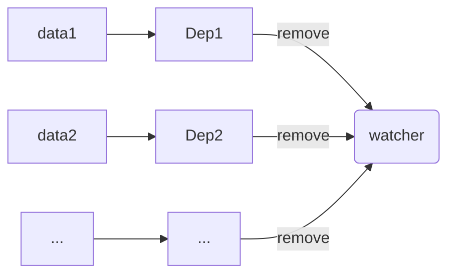
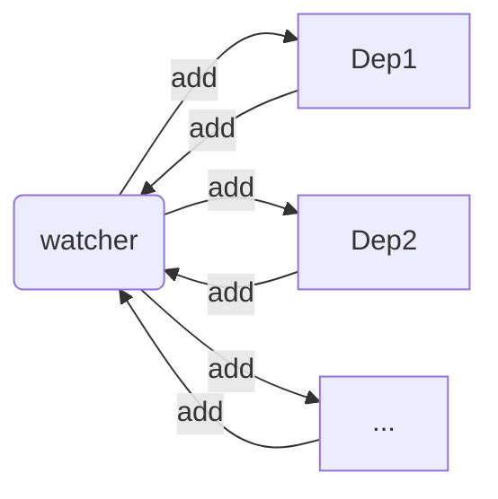

# `$watch 的原理`

[《变化监测》](/observe.html#通过-watcher-触发-getter)中提到了 `Watcher`，展示了它作为依赖的作用是：

- 触发数据的 `getter`，并作为依赖被收集
- 数据变化时，会被通知更新

这篇文章，通过分析 `$watch()` 方法，进一步了解 `Watcher`。

`$watch()` 方法被定义在 `Vue.prototype` 上，所以所有 `Vue` 的实例对象，都拥有该方法。

之后在[《组件挂载》](/mount-component.html#组件的构造函数)章节会分析，组件的构造函数是通过 `Vue.extend()` “继承”自 `Vue` 的，所以所有组件都拥有该方法。

对于 `$watch()` 可能用的不多，但是 `watch` 一定是很熟悉的，实际上 `$watch()` 是 `watch` 的底层 API。

示例：

```js
const vm = new Vue({
  data() {
    return {
      fullname: {
        firstname: 'nail'
      }
    }
  }
})

vm.$watch('fullname.firstname', function (newVal, oldVal) {
  // 做点什么
})
```

这里有几个值得注意的点：

1.  `vm.fullname` 和 `vm.fullname.firstname` 都是响应式数据
2.  通过 `vm.$watch()` 监听了 `vm.fullname.firstname` 的变化，一旦变化就会触发回调
3.  第 2 点同时也说明 `vm.$watch()` 内部一定创建了 `Watcher` 实例，并被 `vm.fullname.firstname` 作为依赖收集了。否则 `vm.fullname.firstname` 变化时不会触发回调

## `Watcher` 是监听器

假设 `$watch()` 内部只有如下代码：

```js
Vue.prototype.$watch = function(path, cb) {
  const vm = this
  new Watcher(vm, path, cb)
}
```

[《变化监测》](/observe.html#通过-watcher-触发-getter)后，我们得到的 `Watcher` 是这样的：

```js
class Watcher {
  constructor(obj, key) {
    this.getter = () => obj.key
  }

  get() {
    target = this
    // 执行后触发 getter
    const value = this.getter()
    target = undefined
    return value
  }

  update() {
    // 更新视图
  }
}
```

现在我们需要注册回调，将代码更新为：

```js
let target

class Watcher {
  constructor(vm, key, cb) {
    // 更新代码
    this.obj = vm
    // 待支持属性路径
    this.getter = () => obj.key
    this.cb = cb
    this.value = this.get()
  }

  get() {
    target = this
    // 执行后触发 getter
    const value = this.getter()
    target = undefined
    return value
  }

  // 更新代码
  update() {
    const value = this.get()
    const oldValue = this.value
    if (value !== oldValue) {
      this.value = value
      this.cb.call(this.obj, value, oldValue)
    }
  }
}
```

## 属性路径

上面的代码中，属性路径的解析还待支持，为了把重点放在讲解 `$watch()` 本身，就不具体将属性路径的解析了（当然本身也够简单）：

`lodash` 中有一个叫 `get` 的函数就做了这个事，举个例子：

```js
const obj = {
  fullname: {
    firstname: 'nail'
  }
}

_.get(obj, 'fullname.firstname') // obj.fullname.firstname
```

把这个函数代入 `Watcher`：

```js
class Watcher {
  constructor(vm, key, cb) {

    // 省略多余代码

    // 更新代码
    this.getter = () => _get(vm, key)
  }

  // 省略多余代码
}
```

你可能会觉得到这里就分析完了，但其实还没有...

## 触发函数

官方示例中，第一个参数还可以是一个函数：

```js
// 函数
vm.$watch(
  function () {
    return this.a + this.b
  },
  function (newVal, oldVal) {
    // 做点什么
  }
)
```

属性路径被替换为了一个函数，函数内部同样会触发响应式数据的 getter。但是仔细看看，这个函数很有意思：

1.  该函数会触发多个响应式数据的 `getter`（如果只需要触发一个数据的 `getter`，那用「属性路径」方式就够了）
2.  第 1 点也就意味着，这个 `Watcher` 实例会被多个响应式数据作为依赖而收集

继续修改 `Watcher`：

```js
class Watcher {
  constructor(vm, keyOrFn, cb) {
    this.obj = vm
    this.cb = cb

    // 更新代码
    if (typeof keyOrFn === 'function') {
      this.getter = keyOrFn.bind(vm)
    } else {
      this.getter = () => _.get(vm, keyOrFn)
    }

    this.value = this.get()
  }

  // 省略多余代码...
}
```

## 取消监听 - 监听器的自我修养

`$watch()` 返回一个取消监听函数，通过该函数停止触发回：

```js
// 省略多余代码...

// 新增代码
const unwatch = vm.$watch(/* 省略多余代码 */)

// 取消监听
unwatch()
```

取消监听的本质是**响应式数据把当前 `watcher` 从依赖列表中移除**。



既然如此，我们就需要去寻找当前值的依赖列表，这有些麻烦了；另外[前面](#触发函数)提过，同一个 `Watcher` 可能被多个依赖列表收集，这就更麻烦了，我们无法**主动**知道[触发函数](#触发函数)中使用了哪些响应式数据，我们只能通过响应式数据知道它收集的依赖。

### 互相保存引用

为了达到这一目的，我们需要在依赖收集时，将依赖容器保存在 `watcher` 中，这么一来：
- `Watcher` 中维护了使用该 `watcher` 实例的 `Dep` 对象
- `Dep` 中维护了当前响应式数据的依赖



修改 `Watcher` 的代码：

```js
class Watcher {
  constructor() {
    // 省略多余代码...

    // 新增代码
    this.deps = []
  }

  // 新增代码
  addDep(dep) {
    if (this.deps.indexOf(dep) === -1) {
      this.deps.push(dep)
    }
  }

  // 省略多余代码...
}
```

修改依赖收集时 `Dep` 的代码：

```js
class Dep {
  constructor() {
    this.subs = []
  }

  addSub(sub) {
    this.subs.push(sub)
  }

  notify() {
    const subs = this.subs
    for (let i = 0; i < subs.length; i++) {
      subs[i].update()
    }
  }

  depend() {
    if (target) {
      if (this.subs.indexOf(target) === -1) {
        this.addSub(target)
      }

      // 新增代码
      target.addDep(this)
    }
  }
}
```

接下来要实现取消监听就容易多了，给 `Watcher` 添加一个取消监听的方法：

```js
class Watcher {
  // 省略多余代码

  // 新增代码
  teardown() {
    const watcher = this
    this.deps.forEach(dep => {
      const index = dep.subs.indexOf(watcher)
      dep.subs.splice(index, 1)
    })
  }
}
```

对应的 `Vue.prototype.$watch()` 就更新为：

```js
Vue.prototype.$watch = function(path, cb) {
  const vm = this
  // 更新代码
  const watcher = new Watcher(vm, path, cb)

  return function unwatch() {
    watcher.teardown()
  }
}
```

## 选项

### `immediate`

`immediate: true` 表示立即以当前值触发回调，简单修改 `Vue.prototype.$watch` 即可：

```js
Vue.prototype.$watch = function(path, cb, options) {
  const vm = this
  const watcher = new Watcher(vm, path, cb)

  // 更新代码
  if (options.immediate) {
    watcher.cb.call(vm, watcher.value)
  }

  return function unwatch() {
    watcher.teardown()
  }
}
```

如图所示，官方文档提醒：

> 不能在第一次回调时取消监听


代码中可以看出，是因为在返回 `unwatch()` 函数前，回调函数就已经执行了。

### `deep`

`deep: true` 表示对一个对象进行深度的检测，即对象内部的值的变化，也会触发回调。

这其实很容易做到，因为对象的所有值都是响应式数据，所以只需要将该 `Watcher` 添加到这些值的依赖列表即可。

所以修改 `Watcher` 代码：

```js
class Watcher {
  constructor(obj, key, cb, deep) {
    // 省略多余代码

    // 新增代码
    this.deep = deep
  }

  // 更新代码
  get() {
    target = this
    // 执行后触发 getter
    const value = this.getter()

    if (this.deep) {
      // 遍历所有 key，并触发 getter
      traverse(value)
    }

    target = undefined

    return value
  }
}

function traverse(val) {
  const keys = Object.keys(val)
  let len = keys.length

  if (typeof val !== 'object') return

  while (len--) {
    traverse(val[keys[i]])
  }
}
```

<!-- ## 完整代码

响应式部分的完整代码更新为：

```js
Vue.prototype.$watch = function(path, cb, options) {
  const vm = this
  const watcher = new Watcher(vm, path, cb)

  if (options.immediate) {
    watcher.cb.call(vm, watcher.value)
  }

  return function unwatch() {
    watcher.teardown()
  }
}

class Watcher {

  constructor(obj, key, cb, deep) {
    this.obj = vm
    this.deep = deep
    this.cb = cb
    this.deps = []
    if (typeof keyOrFn === 'function') {
      this.getter = keyOrFn.bind(vm)
    } else {
      this.getter = () => _.get(vm, keyOrFn)
    }
    this.value = this.get()
  }

  get() {
    target = this
    // 执行后触发 getter
    const value = this.getter()

    if (this.deep) {
      traverse(value)
    }

    target = undefined

    return value
  }

  teardown() {
    const watcher = this
    this.deps.forEach(dep => {
      const index = dep.subs.indexOf(watcher)
      dep.subs.splice(index, 1)
    })
  }

  addDep(dep) {
    if (this.deps.indexOf(dep) === -1) {
      this.deps.push(dep)
    }
  }

  update() {
    const value = this.get()
    const oldValue = this.value
    if (value !== oldValue) {
      this.value = value
      this.cb.call(this.obj, value, oldValue)
    }
  }
}

function traverse(val) {
  const keys = Object.keys(val)
  let len = keys.length

  if (typeof val !== 'object') return

  while (len--) {
    traverse(val[keys[i]])
  }
}

class Dep {
  constructor() {
    this.subs = []
  }

  addSub(sub) {
    this.subs.push(sub)
  }

  notify() {
    const subs = this.subs
    for (let i = 0; i < subs.length; i++) {
      subs[i].update()
    }
  }

  depend() {
    if (target) {
      if (this.subs.indexOf(target) === -1) {
        this.addSub(target)
      }

      target.addDep(this)
    }
  }
}
``` -->
